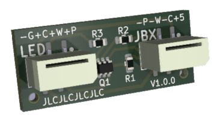

# Juicebox-OpenEVSE LED Adapter

This printed circuit board design adapts the OpenEVSE v1 Juicebox replacement board's 
LED connector to work with the LED harnesses in later model eMotorwerks Juicebox units.

Prior to the acquisition of eMotorwerks by EnelX, many (most?) Juicebox units were provided 
with LED harnesses requiring +5V power to each LED with a common ground return path (-+++).
However, early designs of the OpenEVSE replacement board were designed based on 
earlier model Juiceboxes with LED harnesses requiring a single common +5V power input and 
a ground trace to each LED (+---).  This project aims to bridge the gap between these earlier 
model OpenEVSE boards and later model Juicebox LED harnesses by translating the voltages 
from one orientation to the other.

## The Schematic

As shown in the schematic diagram, the PWR pin on the OpenEVSE board (J1, pin 4) is used as the 
source of common ground for the LEDs.  Since the power light is always on, it is presumed that 
this pin will never be switched off while the other LEDs are in use.  Therefore, power from the 
+5V pin 1 is routed directly to the LED harness's green power LED (J2, pin 1), and the PWR pin 
(now treated as the source for ground) is routed to the harness's common ground (J2, pin 4).

The other two LEDs are switched on ground.  When the LEDs are off, the WIFI and/or CHG pins on 
the OpenEVSE board are floating.  When on, these pins are connected to ground.  To convert this 
behavior into +5V power for each LED, a pair of PNP transistors is used.  +5V is routed to the 
emitter of each transistor, and the collector is connected to each corresponding LED.  When 
negative voltage is applied to the base of each transistor via the WIFI and CHG pins on the 
controller board, the transistor is opened allowing +5V current to flow through to the LED, 
returning on the common ground lane.

Resistors are used on each transistor's base pin to limit the current draw from the emitter 
through the base.  An additional resistor is also added to the red CHG LED to reduce its 
current draw.  Through experimentation, without the added resistance, this LED was found to pull 
about 22 mA of current, while the green and blue LEDs pull closer to 13 mA.  Even with the added 
resistance, the red LED subjectively appears to provide very similar brightness to the other 
two lights.

## Current flow

Simulating the circuit with proposed resistor values using the 
[Falstad Circuit Simulator](https://www.falstad.com), 
this diagram shows the approximate current at each section of the circuit.  At worst case, the 
board is expected to pull no more than 45 to 50 mA.  The resistors shown adjacent to the LEDs 
are included in the existing LED harness.  In the simulation, the values for these resistors were 
set to approximate the current measured at each LED.  As noted above, the red LED was 
found to pull about 22 mA without additional resistance, while the green and blue LEDs each pull 
about 13 mA.

## Prototype

Proof-of-concept prototype boards fabricated in March 2025 using JLCPCB.com board manufacture with 
component assembly.

